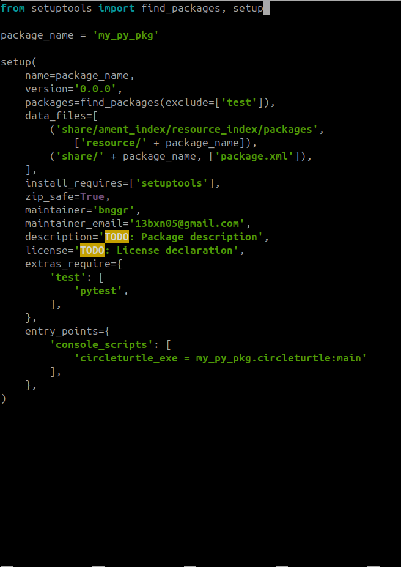

# Introduction to Autonomous System and ROS2

| Name  | Division        | Sub-Division  |
| ----- | ---------- | ---------- |
| Benedictus Imanuel Wicaksono | PGR | Control |

## Penjelasan Circle Turtle

File tersebut harus ditambahkan pada direktori berikut. 
`cd ~/ros2_ws/src/my_py_pkg/my_py_pkg`

Setelah file ditambahkan, tambahkan `'<my_py_pkg.circleturtle:main'` pada file `setup.py` di direktori `~/ros2_ws/src/my_py_pkg/`. 

